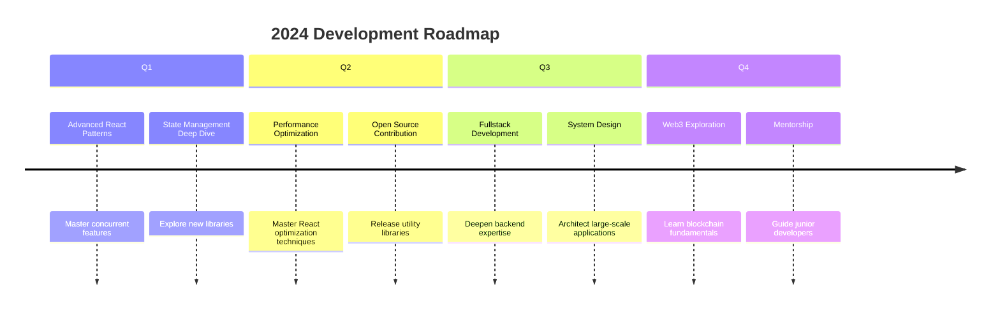

# 🚀 Tuấn Phong's Developer Profile

<div align="center">
  
</div>

<div align="center">
  
</div>

<div align="center">
  
</div>

<div align="center">
  <a href="https://github.com/hoangtuanphong1a" target="_blank">
    
  </a>
  <a href="https://linkedin.com/in/yourprofile" target="_blank">
    
  </a>
  <a href="https://twitter.com/yourprofile" target="_blank">
    
  </a>
  <a href="mailto:your.email@example.com">
    
  </a>
</div>

<br/>

<div align="center">
  
  
</div>

## 🧬 Developer DNA

```typescript
interface DeveloperProfile {
  name: "Tuấn Phong";
  role: "Senior Frontend Developer";
  location: "Vietnam";
  experience: "4+ years";
  education: "Computer Science Degree";
  
  technicalSkills: {
    languages: ["TypeScript", "JavaScript", "Python", "Java", "Rust"];
    frontend: ["React", "Next.js", "Vue", "Svelte", "Angular"];
    backend: ["Node.js", "NestJS", "Express", "Spring Boot"];
    mobile: ["React Native", "Flutter", "Ionic"];
    styling: ["TailwindCSS", "Styled Components", "SASS", "CSS-in-JS"];
    stateManagement: ["Redux", "Zustand", "MobX", "NgRx"];
    testing: ["Jest", "Cypress", "Testing Library", "Vitest"];
    tools: ["Webpack", "Vite", "Babel", "ESLint", "Prettier"];
    databases: ["PostgreSQL", "MongoDB", "Redis", "Firebase"];
    devOps: ["Docker", "Kubernetes", "GitHub Actions", "AWS", "Vercel"];
  };
  
  passions: [
    "Clean Code Architecture",
    "Performance Optimization",
    "User Experience",
    "Mentoring Developers",
    "Open Source Contribution"
  ];
  
  currentlyLearning: ["Web3 Technologies", "Machine Learning Basics", "Rust"];
}
```

## 🛠️ Technical Arsenal

<div align="center">
  
### **Frontend Mastery**


### **Backend Skills**


### **DevOps & Tools**


### **Mobile Development**


</div>

## 📊 Development Analytics

<div align="center">
  
|  |  |
| :-: | :-: |


</div>

## 🎯 Current Focus & Goals



## 🌟 Featured Projects

<div align="center">
  
| <a href="https://github.com/hoangtuanphong1a/project1"></a> | <a href="https://github.com/hoangtuanphong1a/project2"></a> |
| :------------------------------------------------------------------------------------------------------------------------------------------------------------------------------------------: | :------------------------------------------------------------------------------------------------------------------------------------------------------------------------------------------: |

</div>

## 📈 Contribution Activity

[](https://github.com/ashutosh00710/github-readme-activity-graph)

## 📚 Latest Blog Posts

<div align="center">
  
- 🚀 [Optimizing React Performance with Concurrent Features](https://dev.to/yourpost1)
- 🏗️ [Building Scalable Component Libraries in 2024](https://dev.to/yourpost2)
- 📘 [TypeScript Advanced Patterns for Frontend Developers](https://dev.to/yourpost3)
- 🎨 [Creating Beautiful UIs with TailwindCSS and Framer Motion](https://dev.to/yourpost4)

</div>

## 🎨 Development Philosophy

> "I believe in writing code that is not just functional, but also maintainable, scalable, and a joy to work with. Clean code is not a luxury—it's a necessity."

## 🤝 Let's Connect!

<div align="center">
  
[](https://yourportfolio.com)
[](https://linkedin.com/in/yourprofile)
[](https://twitter.com/yourprofile)
[](https://dev.to/yourprofile)

</div>

<div align="center">
  


</div>

<div align="center">
  


</div>
